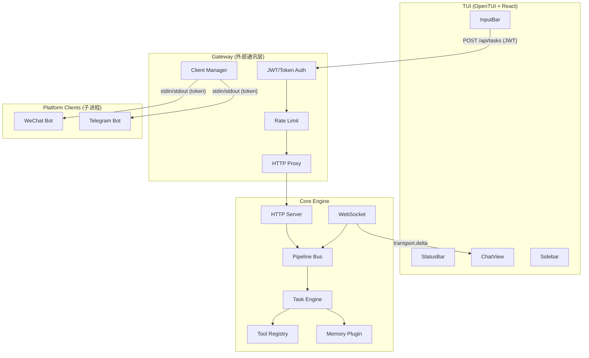

# System Architecture

> **Purpose**: Agent development reference for Atom Neo's runtime design.

---

## 1. 核心设计哲学

| 维度 | 设计 | 收益 |
|------|------|------|
| **任务调度** | 事件驱动：task 入队 → 立即触发 pipeline | 无空转延迟，响应时间 O(1) |
| **上下文管理** | Per-Session 隔离，每个 session 独立实例 | 多 session 并发安全，无需全局锁 |
| **Memory 操作** | `search_memory` / `read_memory` / `save_memory` 注册为 Tool | 摘要发现与正文读取分离 |
| **LLM 输出解析** | `streamText` + tool calling（流式输出 + 结构化工具调用）| 流式体验 + 零解析错误 |
| **Pipeline 组装** | 声明式 `PipelineBuilder`，Element 通过名称引用 | 运行时注册新 pipeline |
| **通信** | WebSocket 事件流（Core → Client 单向广播） | 可观测，可录制，可重放 |
| **调试** | Pipeline Replay — 完整执行记录，可回溯 | 问题复现成本降为 0 |
| **运行时架构** | 微内核 + 插件：Orchestrator + IntentPolicy + ToolCoordinator + MemoryManager | 职责单一，可独立测试 |

---

## 2. 系统架构

### 2.1 三层模型



**架构原则：**
- Core 不轮询队列 → 事件驱动激活
- 每个 session 独立的 SessionContext 实例 → 无状态共享
- Memory 是 Tool Plugin → 走统一调用路径
- 所有通信走 WebSocket 事件流 → 全域可观测

### 2.2 模块结构

```text
atom_neo/
├── src/
│   ├── main.ts                   # 应用入口，CLI 解析 + 启动调度
│   ├── bootstrap/                # 启动层
│   │   ├── cli.ts               # CLI 参数解析
│   │   ├── config.ts            # config.json 加载
│   │   └── env.ts               # .env 加载
│   └── packages/
│       ├── core/
│       │   ├── server.ts         # startCore(deps)
│       │   ├── task-engine.ts
│       │   ├── task-queue.ts / task-factory.ts
│       │   ├── pipeline/         # builder / registry / manager
│       │   ├── session/          # context / store
│       │   ├── tools/            # registry / executor / builtin
│       │   ├── replay/           # recorder / player
│       │   ├── ws/               # handler / broadcaster
│       │   ├── api/              # tasks / health
│       │   └── pipelines/        # conversation / prediction / follow-up-evaluator / context-compress / post-conversation
│       │
│       ├── shared/               # types / pipeline-core / log / protocol / utils
│       ├── gateway/              # auth / ratelimit / proxy / client-manager
│       └── tui/                  # OpenTUI React: App / ChatView / InputBar / Sidebar / hooks
│
├── sandbox/                      # 运行时工作目录
│   ├── config.json              # Model/TUI/Gateway 配置
│   └── .env                     # API Keys
└── docs/
```

---

## 3. 核心创新详解

### 3.1 事件驱动调度

```typescript
class TaskEngine {
  constructor(bus: PipelineEventBus) {
    bus.on("task.enqueued", (task) => this.onTaskEnqueued(task));
    bus.on("pipeline.finished", (result) => this.onPipelineFinished(result));
    bus.on("pipeline.failed", (error) => this.onPipelineFailed(error));
  }

  private onTaskEnqueued(task: TaskItem) {
    if (!this.running) {
      this.runNext();
    }
  }
}
```

**优势：** 无空转等待，任务到达即处理，天然支持并发 pipeline。

### 3.2 Per-Session 上下文隔离

```typescript
class SessionContext {
  constructor(sessionId: string) {
    this.sessionId = sessionId;
    this.messages = [];
    this.inferenceContext = { hiddenFacts: [] };
    this.toolContext = { mode: "idle" };
    this.memoryScopes = { core: "idle", short: "idle", long: "idle" };
  }
}

const session = sessionStore.get(sessionId);
const ctx = session.context;
ctx.addMessage(message);
ctx.setInferenceFacts(facts);
```

**优势：** 多用户并发安全，session 之间完全隔离，销毁简单（`sessionStore.delete(id)`）。

### 3.3 声明式 Pipeline Builder

```typescript
const conversationPipeline = pipeline("conversation")
  .source("collect-prompts", { session })
  .transform("load-system-prompt", {})
  .transform("fetch-agents-prompt", { getCompiledPrompt })
  .transform("collect-context", {})
  .transform("format-system-messages", {})
  .transform("format-user-messages", {})
  .transform("stream-llm", { apiKey, model, tools })
  .boundary("check-follow-up", {})
  .sink("finalize", {})
  .build();
```

**优势：** 运行时注册新 pipeline，支持热重载，Element 按名称查找而非硬编码 import。

### 3.4 Streaming + Tool Calling + IntentRequest

```typescript
// 核心：streamText 提供流式输出 + 结构化工具调用
const result = streamText({
  model,
  system: systemText,          // 独立 system 参数
  messages: userMessages,      // 仅 user/assistant
  tools: aiTools,              // AI SDK 原生工具数组
  maxSteps: 50,
});

let fullText = "";
for await (const chunk of result.fullStream) {
  if (chunk.type === "text-delta") {
    fullText += chunk.textDelta;
    bus.emit("transport.delta", { textDelta: chunk.textDelta });
  }
  if (chunk.type === "tool-call") {
    // 工具调用融入对话流，用户可感知
  }
}

// 流结束后，tail 解析隐蔽 intent
const intents = parseIntentRequests(fullText);
if (intents.some(i => i.request === IntentRequestType.FOLLOW_UP)) {
  ctx.setContinuationContext({ ... });
}
```

**两条路径分工：**
| 机制 | 工具 | 用户感知 | 时机 |
|------|------|----------|------|
| `streamText` tool calling | read, write, bash, search_memory 等 | ✅ 可见，正常反馈 | 流式输出中 |
| IntentRequest 解析 | 仅 `follow_up` | ❌ 无感，隐蔽调度 | 流结束后 |

**优势：** 流式逐字输出 + 工具调用不打断阅读 + follow_up 隐蔽执行，用户无感知。

### 3.5 Pipeline Replay（录制与重放）

```typescript
class PipelineRecorder {
  record(taskId: string, events: PipelineEvent[]): void;
  replay(taskId: string): AsyncIterable<PipelineEvent>;
}

class PipelinePlayer {
  async play(taskId: string) {
    for await (const event of recorder.replay(taskId)) {
      await bus.emit(event.type, event.payload);
    }
  }
}
```

**优势：** 出错后直接重放查看问题，无需重建上下文。开发期快速迭代 pipeline 逻辑。

---

## 4. Pipeline 简化

### 4.1 Pipeline 一览

| Pipeline | 元素数 | 职责 |
|----------|--------|------|
| `conversation` | 9 | 核心对话管线：加载上下文 → 调用 LLM → 处理结果 → 链式续写 |
| `prediction` | 3 | 意图预测：输入分类、难度评估、主题检测 |
| `follow-up-evaluator` | 3 | 长会话质量保障、循环检测、必要时干预或升级模型 |
| `context-compress` | 3 | Token 超限自动压缩。双触发：① Evaluator 检测 80%+ 阈值 ② Conversation 实时 token overflow 检测 |
| `post-conversation` | 3 | 每轮对话后分析结果质量，判定是否需要重试 |

### 4.2 Tool Plugin 接口

```typescript
// src/packages/shared/src/types/tool.ts

export interface ToolDefinition {
  name: string;
  description: string;
  inputSchema: z.ZodSchema;
  execute(args: unknown): Promise<ToolResult>;
}

export interface ToolResult {
  ok: boolean;
  output: string;        // 给 LLM 看的文本结果
  data: unknown;        // 结构化结果（给程序用）
  metadata?: {
    tokensUsed?: number;
    durationMs?: number;
    permission: PermissionLevel;
  };
}

// 内置 tools
const builtinTools: ToolDefinition[] = [
  readTool, writeTool, lsTool, grepTool, treeTool, cpTool, mvTool,
  bashTool,        // 需确认
  searchMemoryTool, saveMemoryTool, traverseMemoryTool, linkMemoryTool, forgetMemoryTool,
];
```

### 4.3 Pipeline Builder DSL

```typescript
// src/packages/core/src/pipeline/builder.ts

export function pipeline(name: string): PipelineBuilder {
  return new PipelineBuilder(name);
}

class PipelineBuilder {
  source( elementName: string, deps?: ElementDeps): this;
  transform(elementName: string, deps?: ElementDeps): this;
  boundary( elementName: string, deps?: ElementDeps): this;
  sink(    elementName: string, deps?: ElementDeps): this;

  build(): Pipeline;
}

// Element 注册表
const elementRegistry = new Map<string, ElementConstructor>();

elementRegistry.set("collect-prompts", CollectPromptsElement);
elementRegistry.set("load-system-prompt", LoadSystemPromptElement);
elementRegistry.set("fetch-agents-prompt", FetchAgentsPromptElement);
elementRegistry.set("collect-context", CollectContextElement);
elementRegistry.set("format-system-messages", FormatSystemMessagesElement);
elementRegistry.set("format-user-messages", FormatUserMessagesElement);
elementRegistry.set("stream-llm", StreamLLMElement);
elementRegistry.set("check-follow-up", CheckFollowUpElement);
elementRegistry.set("finalize", FinalizeConversationElement);

// 使用
const pipeline = pipeline("conversation")
  .source("collect-prompts", { runtime })
  .transform("load-system-prompt", {})
  .transform("fetch-agents-prompt", { getCompiledPrompt })
  .transform("collect-context", { runtime, config })
  .transform("format-system-messages", {})
  .transform("format-user-messages", {})
  .transform("stream-llm", { apiKey, model, tools, bus })  // streamText + tool calling
  .boundary("check-follow-up")  // 解析 follow_up IntentRequest
  .sink("finalize", { runtime })
  .build();
```

---

## 5. WebSocket 事件协议

```typescript
// src/packages/shared/src/protocol.ts

// Client → Core
type ClientEvent =
  | { type: "event.task.submit"; payload: TaskSubmitPayload }
  | { type: "event.task.cancel"; payload: { taskId: string } };

// Core → Client (广播)
type ServerEvent =
  | { type: "event.pipeline.element.started"; payload: ElementStartedPayload }
  | { type: "event.pipeline.element.finished"; payload: ElementFinishedPayload }
  | { type: "event.transport.delta"; payload: TransportDeltaPayload }
  | { type: "event.transport.tool.started"; payload: ToolStartedPayload }
  | { type: "event.transport.tool.finished"; payload: ToolFinishedPayload }
  | { type: "event.task.completed"; payload: TaskCompletedPayload }
  | { type: "event.task.failed"; payload: TaskFailedPayload }
  | { type: "event.task.state-changed"; payload: TaskStatePayload }
  | { type: "event.pipeline.replay-start"; payload: ReplayStartPayload }
  | { type: "event.pipeline.replay-end"; payload: ReplayEndPayload };
```

所有事件统一走 WebSocket，无 HTTP 轮询。Gateway 负责 HTTP API 的 JWT 验证和速率限制后代理到 Core。

---

## 6. HTTP API（Core）

```
POST   /api/tasks              → 提交任务（返回 taskId）
GET    /api/tasks/:id          → 查询任务状态
DELETE /api/tasks/:id          → 取消任务
WS     /ws/:sessionId          → WebSocket 事件流（双向）
GET    /api/health             → 健康检查
GET    /api/metrics            → 运行时指标
```

---

## 7. 权限模型

```typescript
enum PermissionLevel {
  READ_ONLY = 0,   // read, ls, grep, tree, search_memory, read_memory, traverse_memory
  FILE_WRITE = 1,  // + write, cp, mv, save_memory, link_memory, forget_memory
  FULL = 2,        // + bash (需确认)
}

// TUI 直连 Core → PermissionLevel.FULL
// Gateway → JWT claim 中的 permission_level（权限校验待实现）
```

## 相关文档

| 文档 | 说明 |
|------|------|
| [project-structure.md](./project-structure.md) | 模块目录布局 |
| [bootstrap.md](./bootstrap.md) | 启动序列 |
| [pipeline-dev.md](../core/pipeline-dev.md) | Pipeline 一览、Element 开发、Event Bus |
